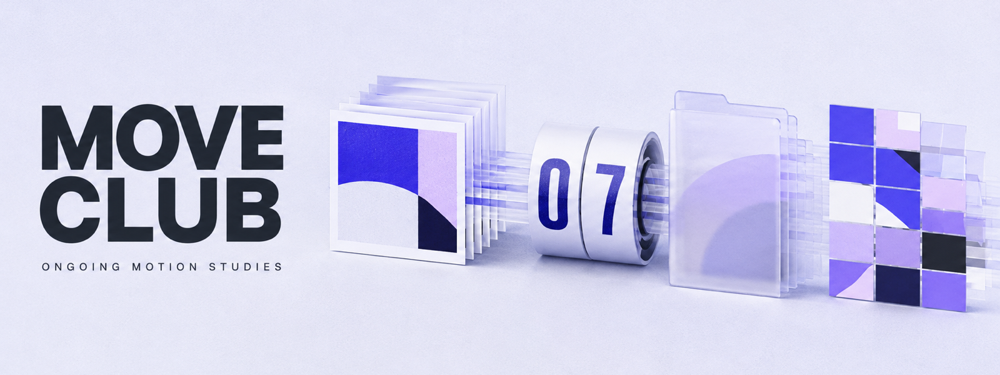
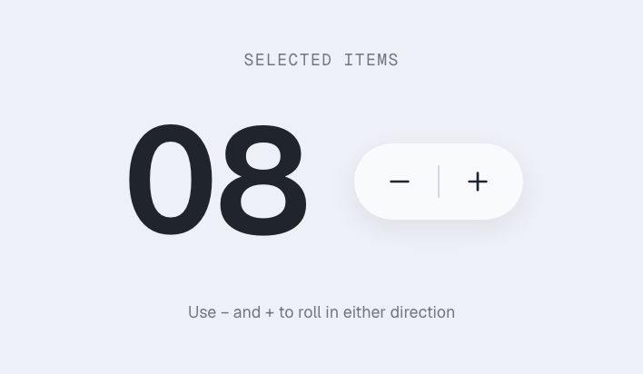
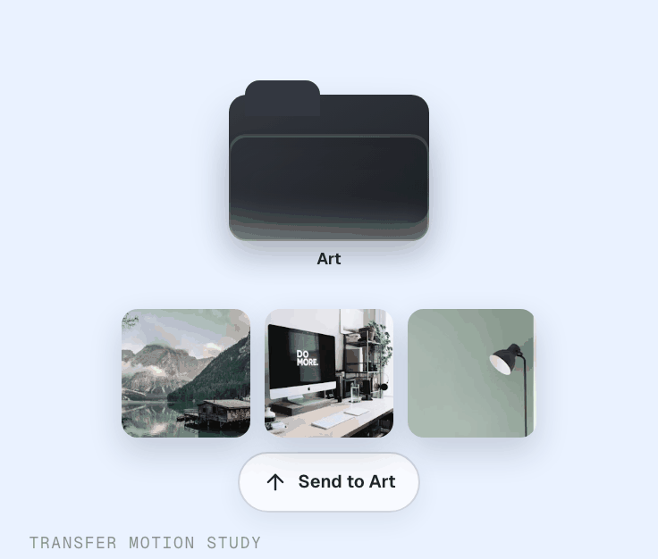
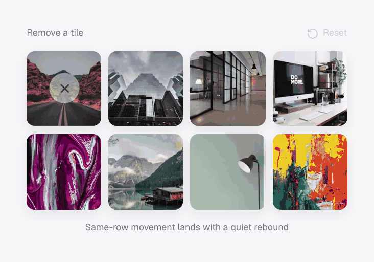

# Move Club

**An open, ongoing collection of small interaction and motion studies.**

[Explore the live playground](https://move-club-photo-motion.ranlous.chatgpt.site) · Built by [Randall D](https://github.com/RandallisLeo)

> **Ongoing:** this collection will keep growing as I study, rebuild, and remix motion patterns found in everyday interfaces.

## Why I built it

Most motion references show the final visual result, but not the decisions that make it feel right. Move Club keeps the interaction and its implementation together, so every study can be experienced, inspected, remixed, and learned from.

It is part sketchbook, part reference shelf, and part open invitation: a place to explore how timing, continuity, layering, masks, springs, and spatial relationships can make interfaces feel clearer and more expressive.

## A few studies in motion

### Count / Reel

<p align="center">
  
</p>

### Cards / Transfer

<p align="center">
  
</p>

### Grid / Reflow

<p align="center">
  
</p>

These are only a small preview. [Explore the full collection on Move Club](https://move-club-photo-motion.ranlous.chatgpt.site).

## Run it locally

```bash
npm install
npm run dev
```

Then open `http://localhost:3000`.

## Add a study

1. Add a component to `components/demos/`.
2. Add its metadata to `data/experiments.ts`.
3. Register the component in `components/motion-gallery.tsx`.

## Built with

React · TypeScript · Motion · Vinext · Cloudflare Workers

## License

MIT. Reuse and adapt the experiments with attribution appreciated.
